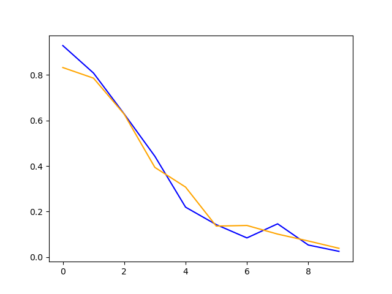
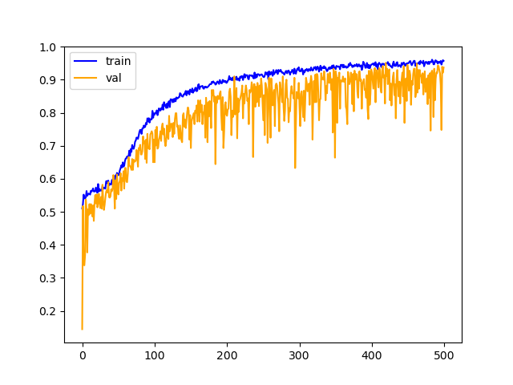
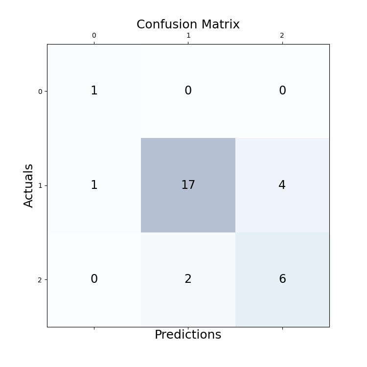

# Alzhimer_severity_detection
## Content
### The data consists of MRI images. The data has four classes of images both in training as well as a testing set:
### 1.Mild Demented - 0
### 2.Moderate Demented - 1
### 3.Non Demented - 2
### 4.Very Mild Demented - 3

## Results:
###   Loss vs Epoch:

###   Accuracy vs Epoch:

###   Confusion Matrix:

