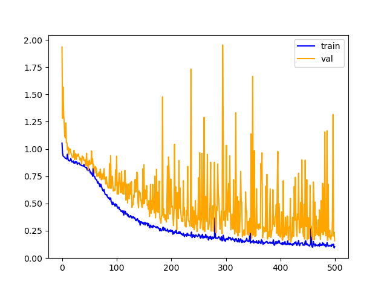

# Alzhimer_severity_detection
## Content
### The data consists of MRI images. The data has four classes of images both in training as well as a testing set:
### 1.Mild Demented
### 2.Moderate Demented
### 3.Non Demented
### 4.Very Mild Demented

## Lables:
###   MildDemented->0
###   ModerateDemented->1
###   NonDemented->2
###   VeryMildDemented->3

## Results:
###   Loss vs Epoch:

###   Accuracy vs Epoch:

